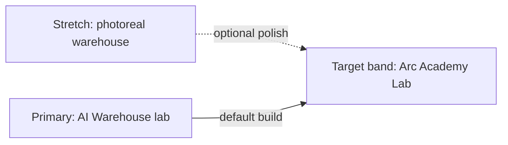

# Arc Academy Visual Vision — Team North Star (Merged Target)

**Status:** Active as of 2026-06-19  
**Audience:** Contributors, agents, reviewers — shared definition of what Bob should _look like_ and _how we get there_  
**Supersedes:** Photoreal-only targeting of [`arc-academy-reference.jpg`](arc-academy-reference.jpg) as the Week 1–2 **primary** goal (that image remains a **stretch** reference)

**Pinned in:** [PROJECT.md](../../PROJECT.md) · [project-plan.md](../project-plan.md) · [what-finished-looks-like.md](../what-finished-looks-like.md) · [what-right-looks-like.md](../what-right-looks-like.md)

---

## One-sentence goal

**Bob** is a cheerful **orange cube** learning **free throws** in a **clean, readable training lab** (AI Warehouse style) with **Arc Academy** basketball identity — one active hoop, decorative environment only, **in-scene scoreboards** showing training progress — optimized for **learning videos and portfolio**, not photoreal warehouse replication.

---

## Reference poles (two images, one target band)

We aim for the **middle band**: readable lab clarity + basketball theme + light Arc Academy polish.

| Pole                       | Image                                                                                                                                            | Role                                                                                                                                                                                                       |
| -------------------------- | ------------------------------------------------------------------------------------------------------------------------------------------------ | ---------------------------------------------------------------------------------------------------------------------------------------------------------------------------------------------------------- |
| **Stretch (aspirational)** | [`arc-academy-reference.jpg`](arc-academy-reference.jpg)                                                                                         | Mood board: warehouse scale, orange court, purple Bob glow, mountain windows. **Week 3+ or optional branch** — not a blocker for training.                                                                 |
| **Primary (achievable)**   | [`ai-warehouse-lab-reference.png`](ai-warehouse-lab-reference.png)                                                                               | **Default target:** white grid-tile walls, dark grid floor, corner room, wall-mounted counters, friendly agent feedback. Inspired by [AI Warehouse](https://www.youtube.com/@AIWarehouse) training videos. |
| **Current baseline**       | [`docs/progress/012-2026-06-19-arc-academy-photoreal-rebuild/capture.png`](../progress/012-2026-06-19-arc-academy-photoreal-rebuild/capture.png) | Layout exists (Bob, hoop, arcs) but style is too busy/dark for training readability.                                                                                                                       |



---

## Non-negotiables (training + scene logic)

These do **not** change when simplifying visuals:

| Rule                                    | Implementation                                                                                             |
| --------------------------------------- | ---------------------------------------------------------------------------------------------------------- |
| **One agent**                           | `BobAgent`, Behavior Name `Bob`, 8 obs / 3 actions                                                         |
| **One scoring hoop**                    | `MovableHoop` + single `HoopScoreZone`; validator enforces exactly one                                     |
| **Decoration does not affect training** | `DecorativeHoopMarker` on bays; **physics layers** `Bob` / `TrainingArena` / `Decoration`                  |
| **Rewards drive learning**              | PPO via `config/bob_free_throw.yaml`; shaping in `BobAgent.cs`                                             |
| **Progress visible in scene**           | `BobTrainingStats` + scoreboards + **success-rate graph** (screen HUD today → **wall panels** in lab mode) |
| **Basketball points**                   | +1 point per made free throw (game score), separate from RL reward                                         |
| **Reproducible scene**                  | `Bob → Rebuild Arc Academy` / `./scripts/validate-scene.sh` → `VALIDATE_PASS`                              |

---

## Merged visual definition (“Arc Academy Lab”)

What the training area should look like when we're done with the visual pivot:

### Environment

- **Corner lab room** (2–3 white walls), not a full industrial warehouse
- **Dark grey floor** with a light **grid** (spatial readability)
- **White walls** with subtle **square tile** grid
- **Soft, even lighting** — one directional + ambient; minimal bloom
- **Single free-throw lane** markings (simple white lines)

### Agent & feedback

- **Orange cube Bob** with simple **eyes** on the front face (AI Warehouse personality)
- **Speech bubble** on made basket (“Great job, Bob!” / “Swish!”)
- Optional: **1–3 white trajectory arcs** toward the hoop (keeps “learning paths” visible)

### Goal

- **One hoop** — simple stand, readable backboard/rim (no 8-bay clutter in lab mode)
- Decorative bays/windows/mountains **removed or hidden** in default lab build

### Scoreboards (in-world, not TensorBoard)

- **Wall-mounted digital panels** (black face, white digits), fed by `BobTrainingStats`:
  - **Iterations** — ML-Agents episodes (shots attempted)
  - **Score** — made baskets (+1 each)
  - **Rewards / penalties** — cumulative RL signal (separate from basketball score)
  - **Success rate** — session % and rolling graph (`BobTrainingSuccessGraph`)
- Keep screen HUD optional for debug; **walls are the hero** for recordings

### Camera

- **High corner angle** into the room (AI Warehouse framing), FOV ~60–70°
- Play mode is the visual source of truth; portfolio captures use `./scripts/capture-progress.sh --play`

### Render pipeline

- Stay on **HDRP** (repo standard) but use **flat/unlit or low-smoothness Lit** materials in lab mode — readability over photorealism
- Photoreal warehouse preset may remain as **`VisualMode.Warehouse`** for future portfolio stills

---

## What we are explicitly deferring

| Deferred                                    | Why                                                            |
| ------------------------------------------- | -------------------------------------------------------------- |
| Pixel-match to `arc-academy-reference.jpg`  | High art cost; blocks training milestone                       |
| 8 peripheral robotic bays in default scene  | Visual noise; decorative only                                  |
| Mountain panoramas, SSR-heavy glossy floors | Not needed for AI Warehouse readability                        |
| ArticulationBody arm IK                     | Decoration only                                                |
| TensorBoard as primary progress UI          | Training metric tool only; audience sees **scene scoreboards** |

---

## Workflow path — steps to accomplish and publish

Work on **`feature/*`** branches → PR → green CI → merge. Never commit directly to `main`.

### Phase 0 — Align (this document) ✅

- [x] Publish shared vision: `docs/design/visual-vision.md`
- [x] Add AI Warehouse reference asset to `docs/design/`
- [x] Update `PROJECT.md`, `project-plan.md`, North Star pointers

### Phase 1 — Week 1 gate (training loop) — **current priority**

| Step | Action                                            | Done when                                                          |
| ---- | ------------------------------------------------- | ------------------------------------------------------------------ |
| 1.1  | `./scripts/validate-scene.sh`                     | `VALIDATE_PASS` ✅                                                 |
| 1.2  | `./scripts/train.sh` → Press Play after port 5004 | Console shows training steps, not inference fallback               |
| 1.3  | Confirm scoreboard + success graph update in Play | Wall HUD + graph move each episode ✅                              |
| 1.4  | Merge training fixes via PR                       | PR #7 CI green → merge                                             |

### Phase 2 — Arc Academy Lab visual mode (default scene)

| Step | Action                                                                               | Done when                                  |
| ---- | ------------------------------------------------------------------------------------ | ------------------------------------------ |
| 2.1  | Simple Arc Academy builder (lab default)                                             | Menu rebuild produces lab room ✅          |
| 2.2  | Lab geometry: corner walls, grid floor/tiles, hide warehouse clutter                 | Validator passes; one hoop ✅              |
| 2.3  | Flat lighting preset (reduce bloom/SSR; soft directional)                            | Play view readable ✅                      |
| 2.4  | Sideline lab camera (`LabHero`)                                                      | Framing matches AI Warehouse sideline ✅   |
| 2.5  | Bob eyes + speech bubble + charisma on score                                         | Visible feedback on made basket ✅         |
| 2.6  | Wall-mounted HUD wired to `BobTrainingStats`                                         | Consolidated panel + dual graph ✅         |
| 2.7  | `./scripts/capture-progress.sh --play arc-academy-lab-ux-v1`                         | Gallery entry `017` ✅                     |
| 2.8  | PR + `pytest tests/test_unity_alignment.py`                                          | 32/32 ✅                                   |

### Phase 3 — Week 2 training demo (publish learning progress)

| Step | Action                                                   | Done when                                            |
| ---- | -------------------------------------------------------- | ---------------------------------------------------- |
| 3.1  | Extend training run; export reward plot                  | Artifact in `docs/results/` or `summaries/`          |
| 3.2  | Record Play-mode clip (Unity Recorder or screen capture) | GIF/MP4 in `docs/progress/` or portfolio folder      |
| 3.3  | Tune reward shaping only after baseline run              | Documented in `config/` + short note in `PROJECT.md` |
| 3.4  | Optional: inference `.onnx` demo without Python trainer  | Play with Behavior Type Inference Only               |

### Phase 4 — Week 3 portfolio publish

| Step | Action                                                     | Done when                                        |
| ---- | ---------------------------------------------------------- | ------------------------------------------------ |
| 4.1  | `terraform/bootstrap` + `terraform/environments/dev` apply | S3 + CloudFront live                             |
| 4.2  | Static site: hero GIF, gallery, write-up                   | `docs/portfolio-site/` synced                    |
| 4.3  | README + `PROJECT.md` live demo URL                        | CloudFront link works                            |
| 4.4  | Optional warehouse polish pass                             | Secondary capture vs `arc-academy-reference.jpg` |

---

## Success criteria checklist

Before calling the visual pivot “done” (Phase 2 complete):

- [x] Press Play → lab readable in **&lt; 5 seconds** (sideline camera, one hoop, Bob + ball)
- [x] **One** hoop scores; bay hoops do not
- [x] Wall HUD shows **iterations**, **basketball points**, **net RL reward**, arc quality graph
- [x] Made basket → **+1 basketball point** + speech bubble
- [x] `./scripts/validate-scene.sh` → `VALIDATE_PASS`
- [x] `./scripts/capture-progress.sh --play arc-academy-lab-ux-v1` → gallery still `017`
- [x] CI pytest unity alignment tests green (32/32)
- [ ] `./scripts/train.sh` + Play → `BOB_TRAINING_OK` (Week 1 gate — blocks “project complete”)

---

## Key repo paths

| Path                                               | Purpose                                |
| -------------------------------------------------- | -------------------------------------- |
| `Assets/Scenes/BobTraining.unity`                  | Training scene                         |
| `Assets/Scripts/Editor/BobTrainingSceneBuilder.cs` | Procedural rebuild                     |
| `Assets/Scripts/BobAgent.cs`                       | ML agent                               |
| `Assets/Scripts/BobTrainingStats.cs`               | Session metrics                        |
| `Assets/Scripts/BobTrainingScoreboard.cs`          | Screen HUD (→ wall boards in lab mode) |
| `Assets/Scripts/BobPhysicsLayers.cs`               | Decoration vs training collision       |
| `config/bob_free_throw.yaml`                       | PPO hyperparameters                    |
| `docs/progress/`                                   | Milestone captures                     |
| `docs/design/visual-vision.md`                     | **This document**                      |

---

## Commands (quick reference)

```bash
# Rebuild + validate scene
./scripts/validate-scene.sh

# Train (Unity Editor open, BobTraining scene)
./scripts/train.sh

# Portfolio capture (Unity Editor closed)
./scripts/capture-progress.sh --play arc-academy-lab-v1

# Offline regression
cd python && source .venv/bin/activate && python -m pytest tests/test_unity_alignment.py -q
```

---

## Related documents

- [what-right-looks-like.md](../what-right-looks-like.md) — milestone + PR workflow diagrams
- [project-plan.md](../project-plan.md) — week-by-week checklist
- [unity-dev.md](../unity-dev.md) — Editor + CLI development
- [PROJECT.md](../../PROJECT.md) — living status

---

## Changelog

| Date       | Change                                                                                            |
| ---------- | ------------------------------------------------------------------------------------------------- |
| 2026-06-19 | Initial merged vision: AI Warehouse lab primary, photoreal warehouse stretch; workflow Phases 0–4 |
