# Bob Build Progress

Chronological Unity scene screenshots documenting project milestones.

## How to capture

- **Unity Editor:** Bob → Capture Progress Screenshot
- **CLI (edit):** `./scripts/capture-progress.sh <milestone-label>`
- **CLI (play):** `./scripts/capture-progress.sh --play <milestone-label>`

See [unity-dev.md](../unity-dev.md#progress-screenshots) for details.

## Gallery

| #   | Date       | Label                          | Mode | Preview                                                                                      |
| --- | ---------- | ------------------------------ | ---- | -------------------------------------------------------------------------------------------- |
| 001 | 2026-06-18 | initial-scene                  | edit |                                    |
| 002 | 2026-06-18 | restart-test                   | edit |                                      |
| 004 | 2026-06-18 | arc-academy-mvp                | edit |                                |
| 005 | 2026-06-18 | arc-academy-visual-v2          | edit |                    |
| 006 | 2026-06-18 | arc-academy-hdrp-v1            | edit |                        |
| 007 | 2026-06-18 | post-merge-hdrp-compare        | edit | 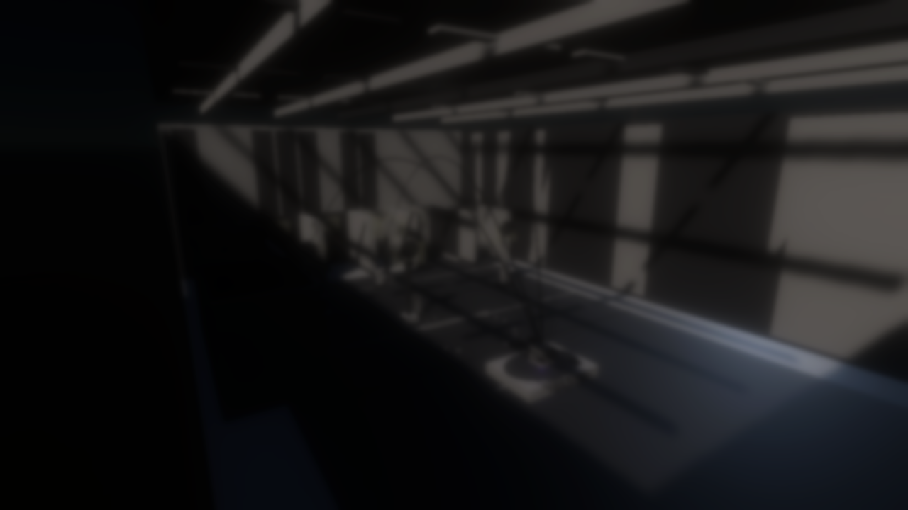               |
| 008 | 2026-06-18 | arc-academy-polish-v1          | edit | 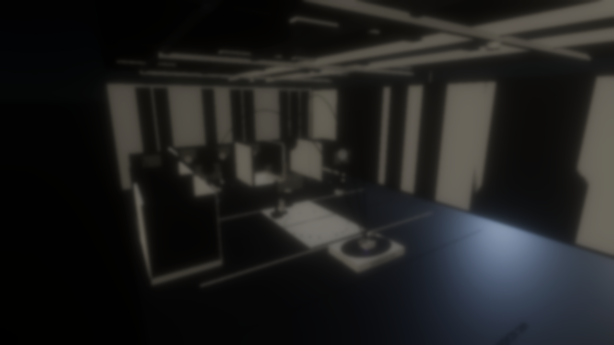                   |
| 009 | 2026-06-18 | arc-academy-final-polish       | edit | 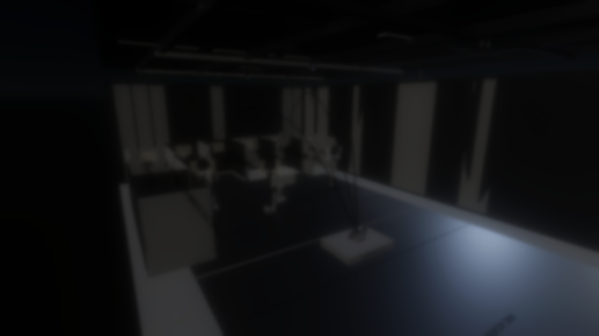             |
| 010 | 2026-06-19 | wiley-widget-demo              | edit | 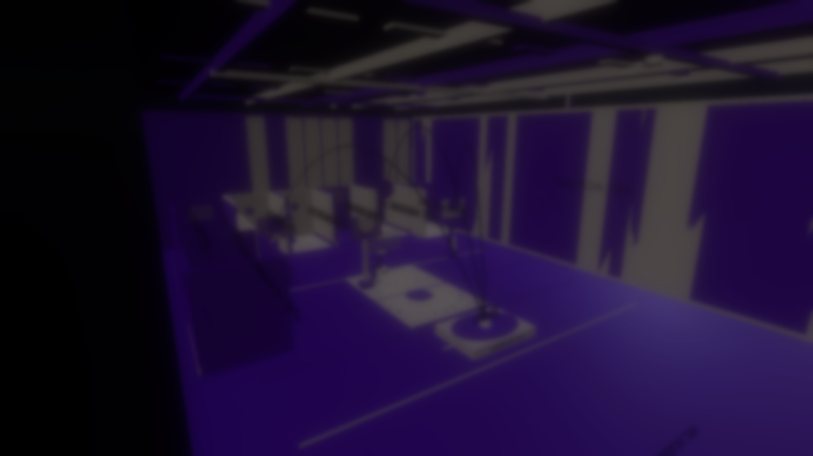                           |
| 011 | 2026-06-19 | hdrp-materials-fixed           | edit | 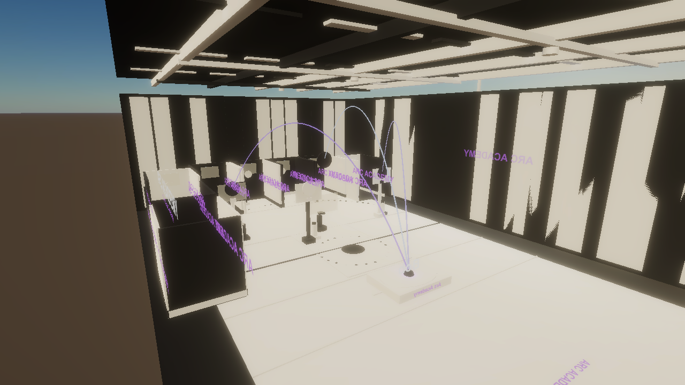                     |
| 012 | 2026-06-19 | arc-academy-photoreal-rebuild  | edit | 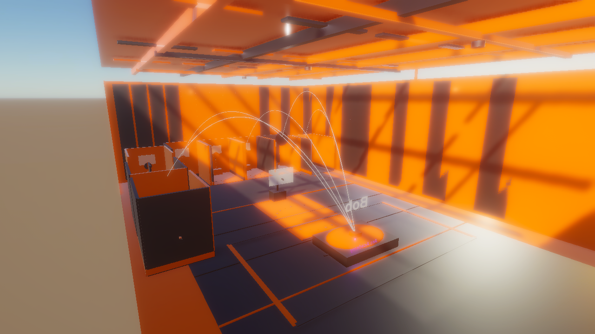   |
| 013 | 2026-06-19 | arc-academy-playmode-hero      | play | 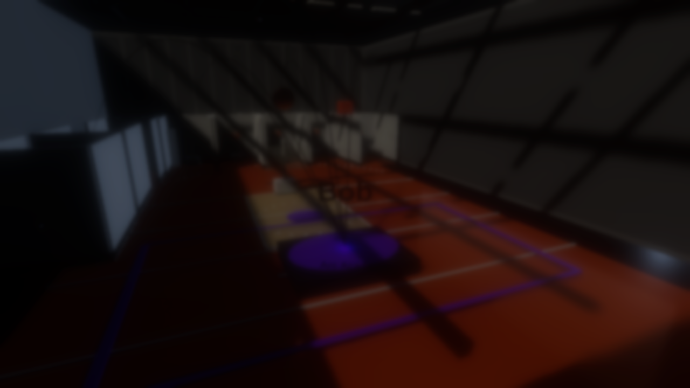           |
| 014 | 2026-06-19 | arc-academy-hdrp-v1            | edit | 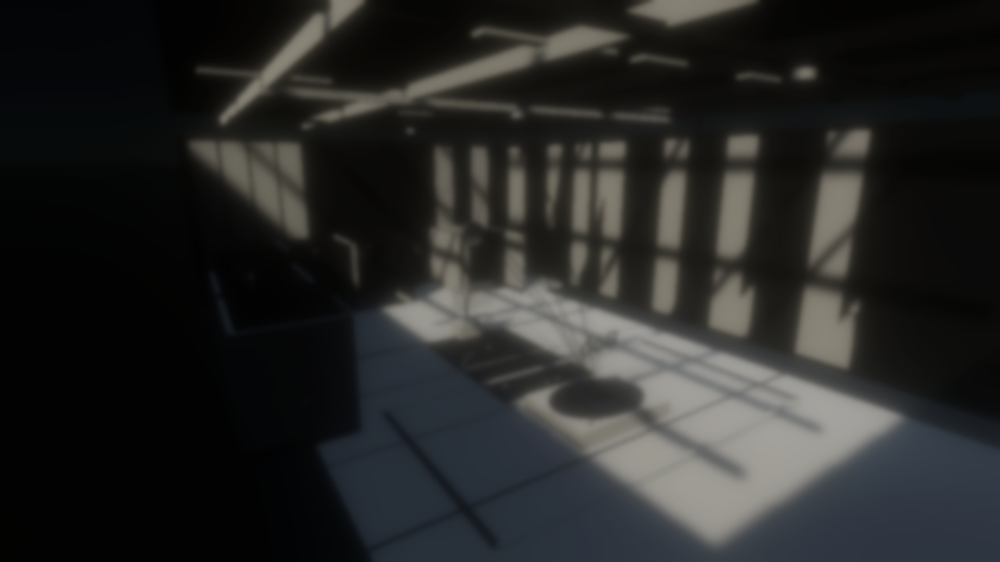                       |
| 015 | 2026-06-22 | arc-academy-lab-incremental-v1 | play | 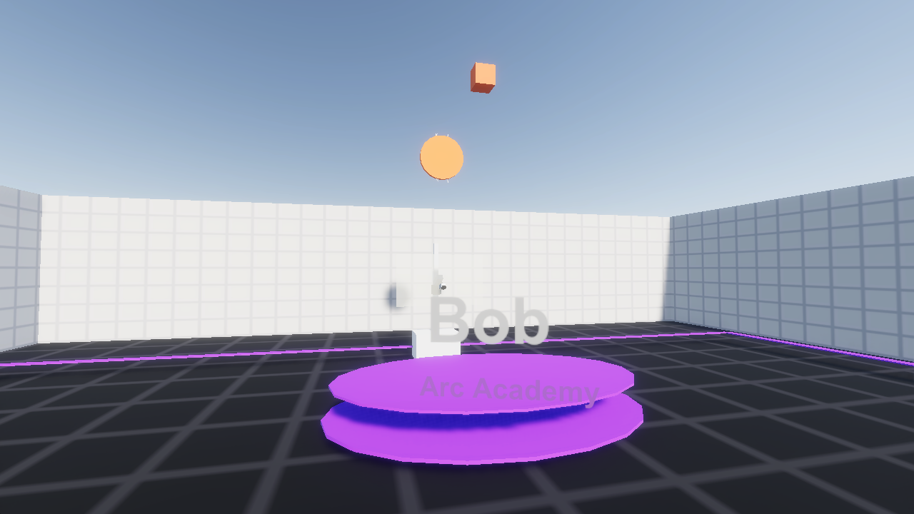 |
| 016 | 2026-06-22 | arc-academy-ball-v1            | play | 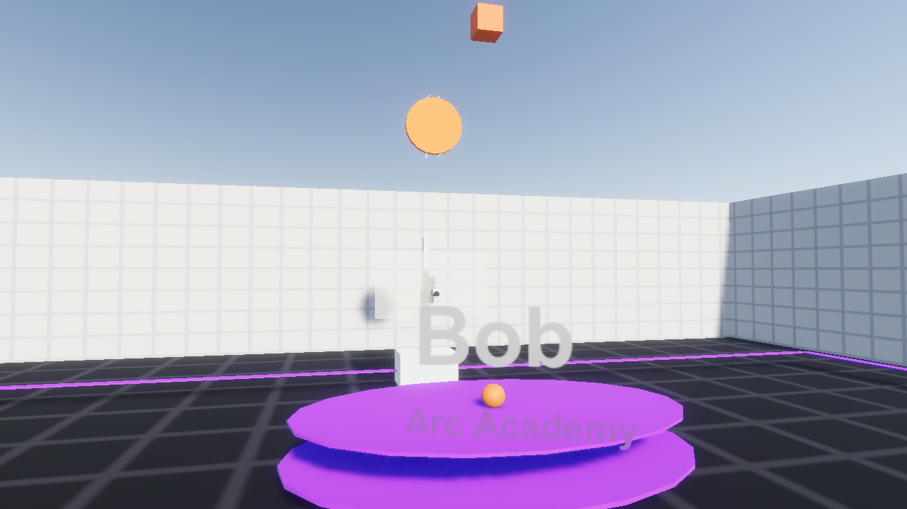                       |
| 017 | 2026-06-22 | arc-academy-lab-ux-v1          | play |                    |
| 018 | 2026-06-22 | arc-academy-lab-v1             | play | 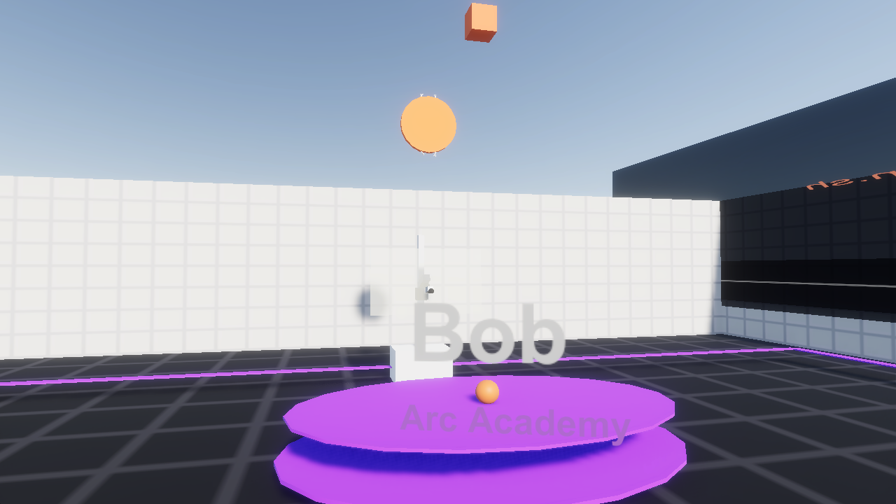                         |
| 019 | 2026-06-22 | arc-academy-train-gate-v1      | play | 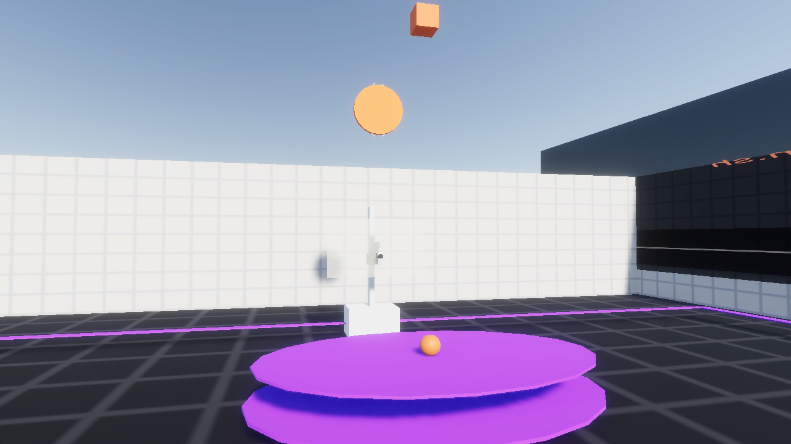           |
| 020 | 2026-06-23 | lab-hud-south-v1               | play |                              |
| 021 | 2026-06-23 | bob-visual-v1                  | play |                                    |
| 022 | 2026-06-24 | lab-hero-v2                    | play | 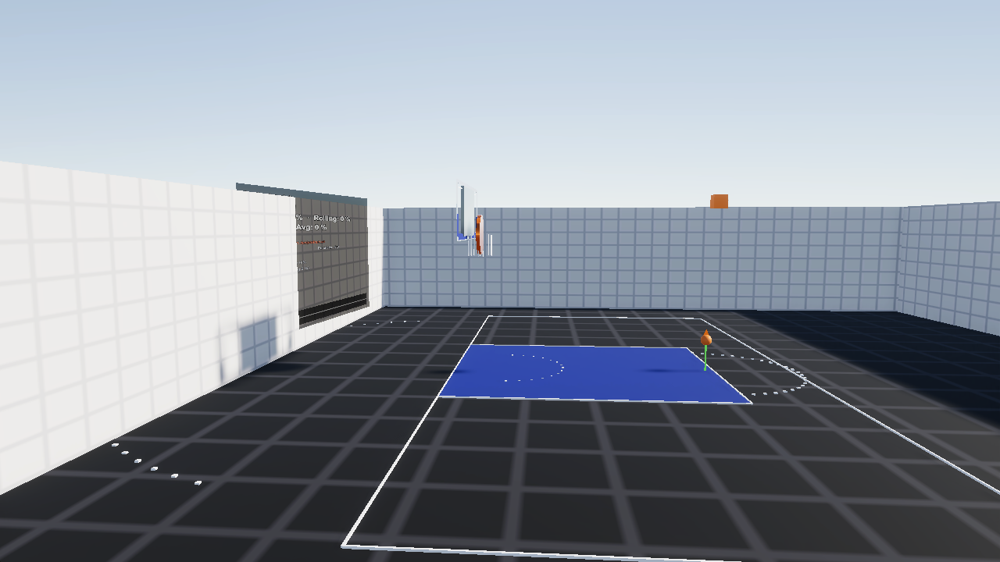                                       |
