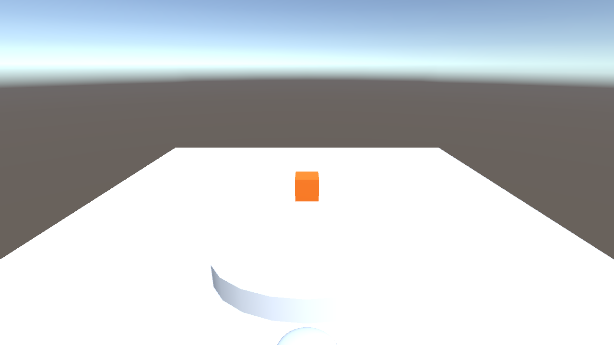

# Bob Build Progress

Chronological Unity scene screenshots documenting project milestones.

## How to capture

- **Unity Editor:** Bob → Capture Progress Screenshot
- **CLI:** `./scripts/capture-progress.sh <milestone-label>`

See [unity-dev.md](../unity-dev.md#progress-screenshots) for details.

## Gallery

| # | Date | Label | Mode | Preview |
|---|------|-------|------|---------|
| 001 | 2026-06-18 | initial-scene | edit |  |
| 002 | 2026-06-18 | restart-test | edit |  |
