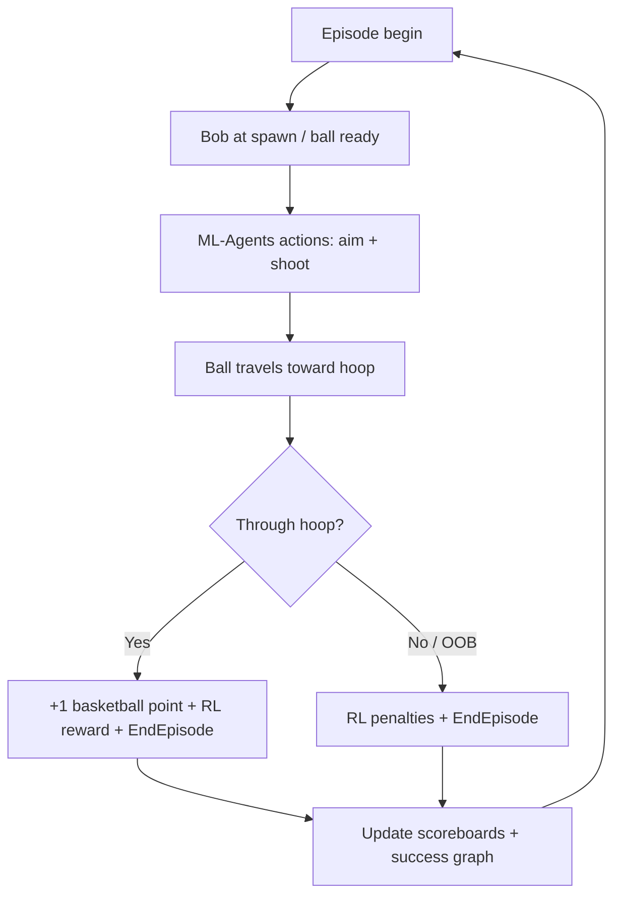

# What Finished Looks Like — Bob Product Definition

**Audience:** Team, agents, reviewers — runtime behavior and training UX when the project is **done** (MVP + demo-ready).  
**Visual style:** [docs/design/visual-vision.md](design/visual-vision.md) (Arc Academy Lab, AI Warehouse–inspired).  
**Dev workflow:** [what-right-looks-like.md](what-right-looks-like.md) (PRs, CI, weeks).

---

## Finished experience (30-second summary)

Press **Play** (optionally with `./scripts/train.sh` connected). You see a **clean training lab**, an **orange cube agent (Bob)** at the free-throw line, and **one basketball hoop**. Each **iteration**, Bob **shoots toward the hoop**. When the shot **goes in**, Bob earns **+1 basketball point** on the **in-scene scoreboard**. Over many iterations, PPO **improves aim** — visible on a **success-rate graph** and rising **score**. Cumulative **RL rewards** and **penalties** accumulate separately (for learning diagnostics). Decorative geometry never interferes with physics.

---

## Core loop

---

## Finished components

| Component         | Finished behavior                                                                                        | Current status                                                                  |
| ----------------- | -------------------------------------------------------------------------------------------------------- | ------------------------------------------------------------------------------- |
| **Agent**         | Orange cube launcher; Behavior Name `Bob`; learns via PPO                                                | Implemented (`BobAgent`)                                                        |
| **Projectile**    | Basketball rigidbody shot from spawn toward hoop                                                         | Implemented — `BasketballProjectileSetup` + single `Basketball` in simple arena |
| **Goal**          | Exactly **one** active `HoopScoreZone`                                                                   | Implemented + validated                                                         |
| **Decoration**    | Bays/walls optional; **no collision** with Bob/ball                                                      | Physics layers implemented                                                      |
| **Scoreboard**    | In-scene panels: **iterations**, **score**, **cumulative rewards**, **cumulative penalties**, **net RL** | World-space wall HUD when simple arena active; OnGUI fallback for warehouse     |
| **Success graph** | Rolling **success rate %** + **arc quality** over recent iterations                                      | Wall HUD dual graph + `BobTrainingSuccessGraph` fallback                        |
| **Feedback**      | Speech bubble / popup on made basket                                                                     | Implemented (`BobSpeechBubble` + `ArcAcademyScorePopup`)                        |
| **Training**      | `./scripts/train.sh` + Play; steps in console                                                            | **Verified** 2026-06-23 — `BOB_TRAINING_OK`, trainer Step lines, session CSV    |
| **Portfolio**     | Play-mode GIF + static site (Week 3)                                                                     | Scaffold at `docs/portfolio-site/`; Terraform Week 3                            |

---

## Scoreboard variables (canonical)

All values come from [`BobTrainingStats`](../Assets/Scripts/BobTrainingStats.cs):

| Display label       | Field                      | Meaning                                       |
| ------------------- | -------------------------- | --------------------------------------------- |
| **Iterations**      | `TotalIterations`          | ML-Agents episodes (shot attempts)            |
| **Score**           | `BasketballPoints`         | Made baskets (+1 each, basketball rules)      |
| **Rewards**         | `TotalRewards`             | Sum of positive RL `AddReward` values         |
| **Penalties**       | `TotalPenalties`           | Sum of negative RL magnitudes                 |
| **Net RL**          | `NetSessionReward`         | Rewards − penalties                           |
| **Success rate**    | `SessionSuccessRate`       | `BasketballPoints / TotalIterations` (0–100%) |
| **Rolling success** | `RollingSuccessRate`       | Recent-window rate for the graph              |
| **Arc quality**     | `RollingAverageArcQuality` | Recent-window peak arc quality (0–100%)       |

Session rows append to `summaries/bob_session.csv` via [`BobTrainingSessionLog`](../Assets/Scripts/BobTrainingSessionLog.cs) for offline plots.

TensorBoard remains a **developer** tool (`tensorboard --logdir results`) — not the audience-facing progress UI.

---

## Development workflow — actions to ship

Work on `feature/*` → PR → green CI. See [visual-vision.md](design/visual-vision.md) for visual phases.

### Phase 1 — Training loop

- [x] `./scripts/validate-scene.sh` → `VALIDATE_PASS`
- [x] `./scripts/train.sh` → Play → training steps in console (`BOB_TRAINING_OK`)
- [x] Scoreboard + success graph update in Play
- [x] PR #7 merge to `main`

### Phase 1.5 — Basketball projectile

- [x] `Basketball` at spawn release point (orange sphere, `Rigidbody`, `SimpleBasketball`)
- [x] `BobAgent` applies force to ball; launcher cube kinematic at pad (`BasketballProjectileSetup`)
- [x] `./scripts/validate-scene.sh` → `VALIDATE_PASS` with projectile wired
- [x] `./scripts/train.sh` + Play → single-shot training loop verified
- [x] `HoopScoreZone` detects ball via `SimpleBasketball` (8 obs / 3 actions unchanged)
- [x] Validator + alignment tests (32/32)

### Phase 2 — Arc Academy Lab visuals

- [x] Lab room builder (grid floor, white walls, sideline `LabHero` camera)
- [x] Wall-mounted training HUD (`BobWallTrainingHud` on `Wall_South`, back wall behind hoop)
- [x] Bob eyes + speech bubble + squash/stretch + power-path pulse
- [x] `--play` captures: `arc-academy-lab-incremental-v1`, `arc-academy-ball-v1`, `arc-academy-lab-ux-v1`

### Phase 3 — Learning demo

- [x] Session CSV export + `python/scripts/plot_training_progress.py`
- [x] Plot copied to `docs/results/training_progress.png` (bob-v2 segment, 865 iterations @ 20×, 2026-06-24)
- [x] Extended **bob-v2** training run after launch-direction rewards + refresh plot
- [ ] Training GIF for portfolio
- [ ] Optional inference `.onnx` demo

### Phase 4 — Publish

- [ ] Terraform bootstrap + dev apply (**deferred** — not deployed to AICO AWS; use a separate portfolio AWS profile when ready)
- [x] Portfolio site scaffold (`docs/portfolio-site/index.html`) — hero `022` + training plot wired
- [ ] CloudFront live demo URL in README (after non-AICO deploy)

---

## Agent rules (for Cursor / `AGENTS.md`)

1. **Do not** scope photoreal warehouse as default — [visual-vision.md](design/visual-vision.md) Lab is primary.
2. **Do not** add second scoring hoop or change Behavior Name from `Bob` without YAML + validator updates.
3. **Do** keep scoreboard metrics in sync with `BobTrainingStats` — single source of truth.
4. **Do** advance Week 1 gate (training loop) before Phase 2 visual polish.
5. **Query** `bob-rag` before code; **Unity MCP** before scene edits.

---

## Related

- [**AI Warehouse ops**](design/ai-warehouse-ops.md) — training patterns + log anomaly guide
- [PROJECT.md](../PROJECT.md) — status
- [docs/project-plan.md](project-plan.md) — milestones
- [AGENTS.md](../AGENTS.md) — agent instructions
