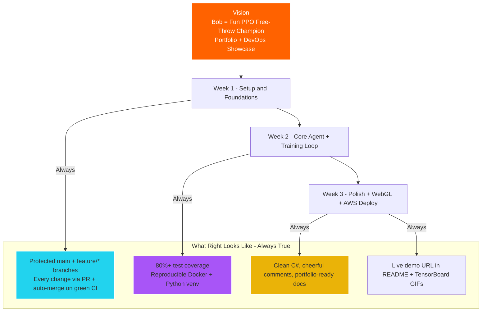
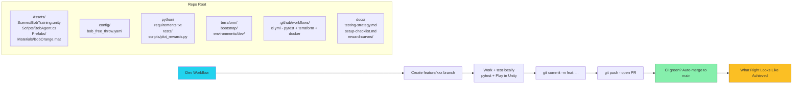

# What Right Looks Like — Bob North Star

**Canonical visual spec** for [bigessfour/bob](https://github.com/Bigessfour/Bob). Every agent, contributor, and planning session must align with these diagrams before proposing work, opening PRs, or merging changes.

**Pinned in:** [PROJECT.md](../PROJECT.md) · [AGENTS.md](../AGENTS.md) · [project-plan.md](project-plan.md) · [`.cursor/rules/bob.mdc`](../.cursor/rules/bob.mdc)

---

## How to use this document

| When              | Action                                                                                                      |
| ----------------- | ----------------------------------------------------------------------------------------------------------- |
| **Planning**      | Read both diagrams; confirm the task maps to the current week milestone and permanent quality bars          |
| **Before coding** | Ask: does this change move us toward the diagram, or is it scope creep?                                     |
| **Before a PR**   | Verify feature branch → green CI → merge to `main`; never commit directly to `main`                         |
| **Agent turns**   | Reference this doc in [AGENTS.md](../AGENTS.md); query `bob-rag` with `what-right-looks-like` for alignment |

If a proposed change does not advance a milestone **and** satisfy at least one permanent quality bar (E–H below), defer it.

---

## 1. Milestones + permanent quality bars

**Week 1** ✅ foundations (Unity project, CI, agent scaffold, DevOps scaffold).  
**Week 2** — training loop, reward shaping, progress captures.  
**Week 3** — polish, WebGL, Terraform apply, live demo URL.

---

## 2. Repo structure + dev workflow compass

---

## Alignment checklist (agents)

Before suggesting or implementing changes, confirm:

- [ ] Task maps to **current week** in [PROJECT.md](../PROJECT.md) (see Current Milestone)
- [ ] Change respects **repo layout** (Assets, config, python, terraform, docs — not ad-hoc paths)
- [ ] Work happens on **`feature/*`** (or fix branch), not direct commits to `main`
- [ ] **CI must pass** before merge (pytest, Terraform, Docker build)
- [ ] **Hyperparameters** stay in `config/*.yaml`; **Behavior Name** stays `Bob`
- [ ] **Docs updated** when behavior, workflow, or milestones change
- [ ] **Portfolio artifacts** (GIFs, demo URL, progress gallery) tracked for Week 2–3

---

## Related

- [project-plan.md](project-plan.md) — week-by-week checklist
- [testing-strategy.md](testing-strategy.md) — coverage targets toward 80%+
- [PROJECT.md](../PROJECT.md) — living status and next actions
- [AGENTS.md](../AGENTS.md) — agent rules including RAG and Unity MCP
